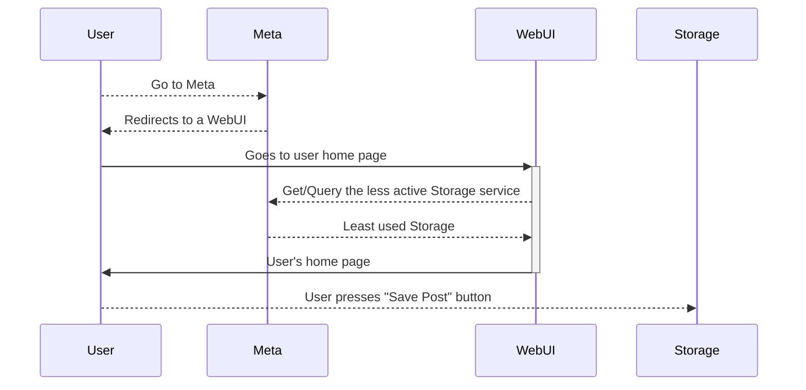
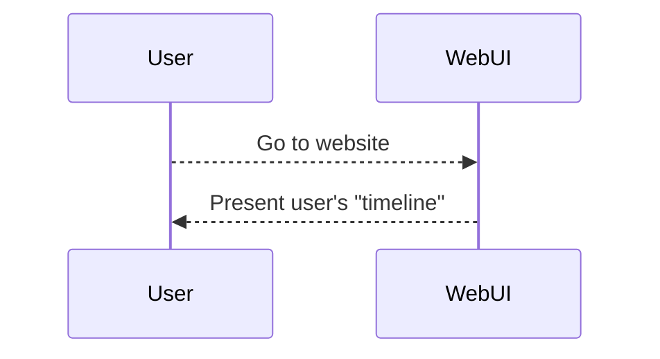

# Requirements Doc for ClapTrap

## Microservice Design

* All need a local DB for any permenant data storage, persistent data
* API's are needed connect Microservices together and provide transfer of information
* The code that implements this microservice's goal

Graphically:

```
+----- Microservice A -----+
|                          |
| +-- Logic --+            >-- API 1
| |    ...    |            |
| +-v---------+            }-- API 2
|   |                      |
|   |    +-- DB --+        ]-- API 3
|   -----<   ...  |        |
|        +--------+        |
+--------------------------+
```

### Basics of a Microservice

#### Benefits

* Separation of Concerns
* Failsafe / Redundancy
* Everything is completely Modular (coding language, ect.)

### Services in ClapTrap

#### Frontend: UI

We shall have a service to handle the user interaction.

Tech: `bottle.py` is our main tool here

#### STORAGE SERVICE

#### Meta Service

Its job is to know the status and state of all services and provide
information on such to any client.

#### 

#### OTHER SERVICE ??


## Technologies to be Used

### Python

Python shall be our language of implementation.

### SQLite

SQLite will be our DB.

### Bottle

Bottle will be our web UI and routing.

## Use Cases

### Create Post



WebUI-->>Storage: Stores post on database
Storage-->>MicroService: Creates Post
MicroService-->>WebUI: Puts post on Web for others to see 

### Sequence Diagram

```mermaid
sequenceDiagram
  User->>+WebMS: Get user's timeline (<user>/timeline)
  WebMS->>StorageMS: Get previous claps
  StorageMS->>WebMS: Returns previous claps
  WebMS->>-User: Returns the user's timeline HTML page

  User->>+StorageMS: Posts a clap
  StorageMS->>User: Return a redirect to the user's timeline
  User->>WebMS: Get user's timeline
  WebMS->>StorageMS: Get previous claps
  StorageMS->>WebMS: Returns previous claps
  WebMS->>-User: Returns the user's timeline HTML page

  User->>Storage: (1) Post (<user>/timeline)

  User->>WebMS: (2) Get (<user>/timeline)

  WebMS->>-Storage: (3) Get 

  Storage-->>User: (redirect)

```
(1) The user makes a new clapback which is sent to the storage microservice. The storage MS redirects back to the users timeline.

(2) User goes to their timeline @ the WebUI MS.

(3) The WebUI MS goes to the storage MS to get the users previous claps.

### Rate a post



### Comment on a post

```mermaid
    sequenceDiagram
```

### Read someone else's posts

### Repost someone else's post